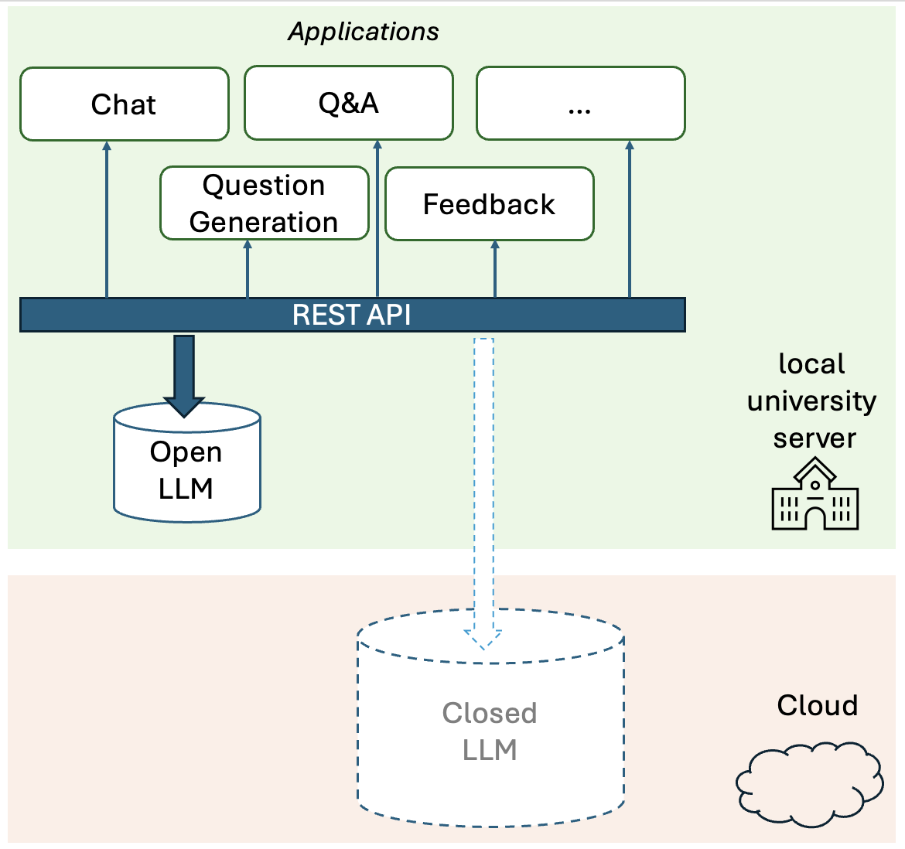
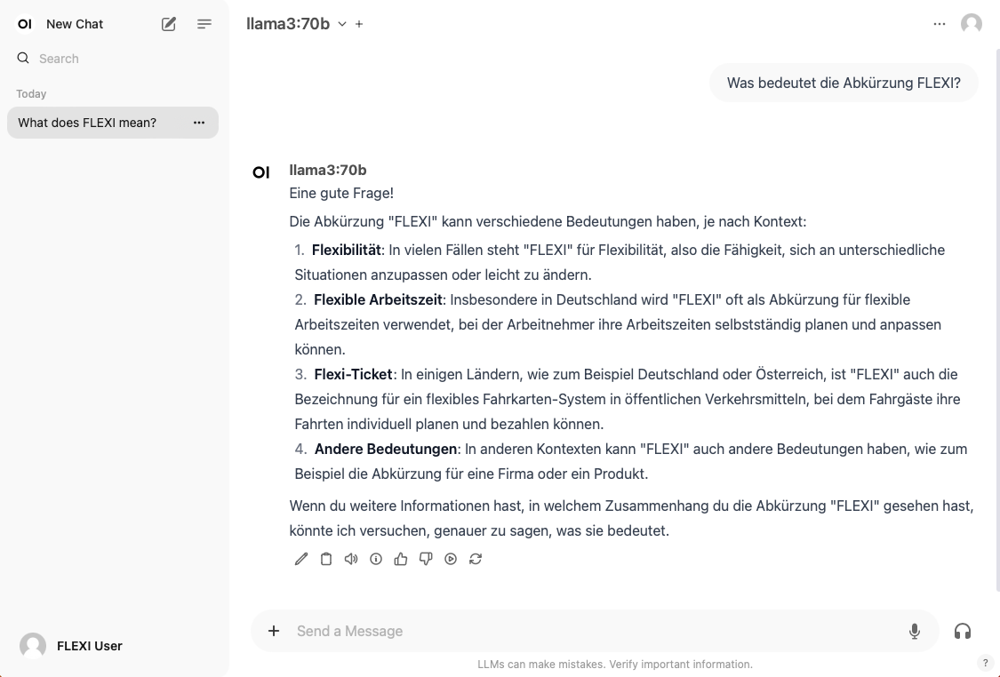
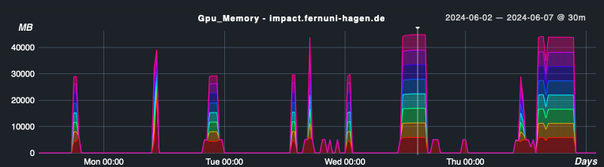

# FernUni LLM Experimental Infrastructure (FLEXI)

## Abstract

Using the full potential of LLMs in higher education is hindered by challenges with access to LLMs.
The two main access modes currently discussed are paying for a cloud-based LLM or providing a locally maintained open LLM.
We describe the current state of establishing an open LLM infrastructure at FernUniversität in Hagen under the project name FLEXI (FernUni LLM Experimental Infrastructure).
FLEXI enables experimentation within teaching and research with the goal of generating strongly needed evidence in favor (or against) the use of locally maintained open
LLMs in higher education.
We provide some practical guidance for everyone trying to decide whether to run their own LLM server.

## Reference
A preprint describing FLEXI

> [FernUni LLM Experimental Infrastructure (FLEXI) -- Enabling Experimentation and Innovation in Higher Education Through Access to Open Large Language Models](flexi.pdf)

You may cite our work using this reference:

```
@misc{ZeschEtal2024flexi,
  title={{FernUni LLM Experimental Infrastructure (FLEXI) -- Enabling Experimentation and Innovation in Higher Education Through Access to Open Large Language Models}},
  author={Torsten Zesch and Michael Hanses and Niels Seidel and Piush Aggarwal and Dirk Veiel and Claudia de Witt},
  year={2024},
  howpublished={\url{https://github.com/zesch/flexi}}
}
```

## Concept
Replacing a closed LLM with an open LLM can be as easy as pointing the applications to a local REST endpoint once a local LLM is in place.



For more information on how to deploy your own local LLM as well as our experiences with running an open LLM, please refer to our [paper preprint](flexi.pdf).

Based on our open LLM server, we support a wide range of applications including a OpenWebUI-based chat interface.



We closely monitor server load. The memory usage of all 8 GPUs is shown in color. The image shows usage spikes during a longer period of use.  Usually, all 8 GPUs are used. However, as soon as it is sufficient to use only one GPU, e.g. for a smaller model (see smaller red spikes), the system implements this accordingly and in a resource-saving manner.

